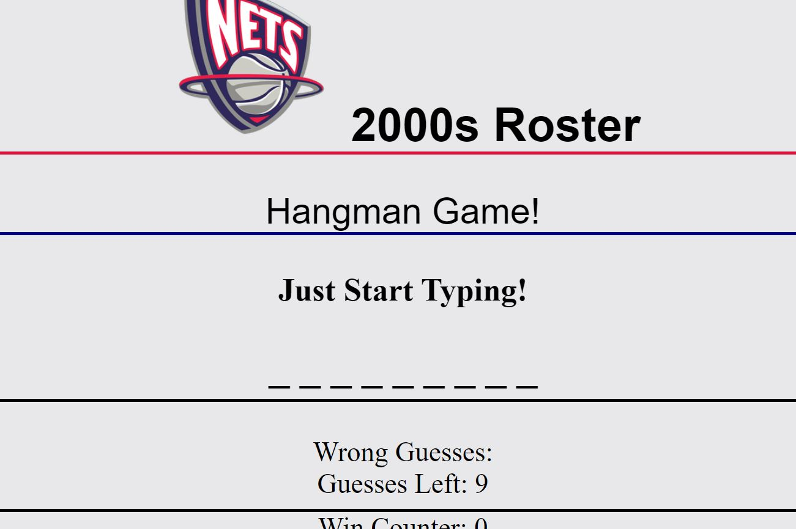

# [2000s NJ Nets Hangman](https://alexlo15.github.io/2000snetshangman/)
RU-SOM-FSF-FT-06-2019-U-C | Homework #4

___

## Motivation
Create a basic hangman game to introduce myself to JavaScript.

## Technologies used and why

**Built with:**
* [JavaScript]
* [HTML]
* [CSS}
* [Bootstrap]

## License
A short snippet describing the license (MIT, Apache etc)

MIT © 
[Alex Lo](https://github.com/alexlo15)

